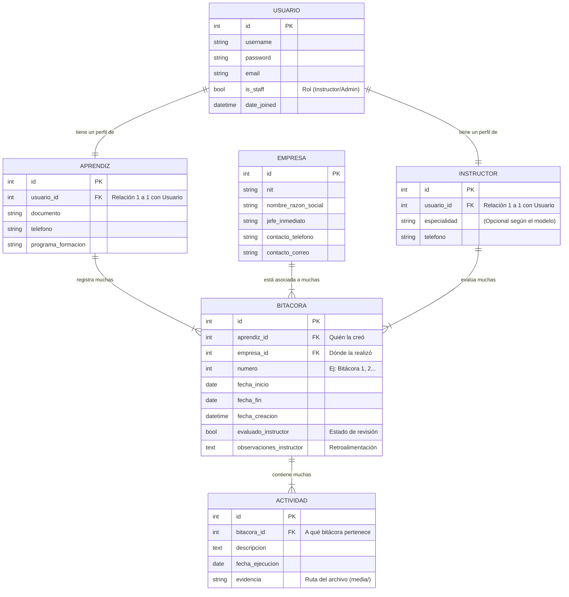

```mermaid
erDiagram
    USUARIO ||--|| APRENDIZ : "tiene un perfil de"
    USUARIO ||--|| INSTRUCTOR : "tiene un perfil de"
    APRENDIZ ||--|{ BITACORA : "registra muchas"
    EMPRESA ||--|{ BITACORA : "está asociada a muchas"
    BITACORA ||--|{ ACTIVIDAD : "contiene muchas"
    INSTRUCTOR ||--|{ BITACORA : "evalúa muchas"

    USUARIO {
        int id PK
        string username
        string password
        string email
        bool is_staff "Rol (Instructor/Admin)"
        datetime date_joined
    }

    APRENDIZ {
        int id PK
        int usuario_id FK "Relación 1 a 1 con Usuario"
        string documento
        string telefono
        string programa_formacion
    }

    INSTRUCTOR {
        int id PK
        int usuario_id FK "Relación 1 a 1 con Usuario"
        string especialidad "(Opcional según el modelo)"
        string telefono
    }

    EMPRESA {
        int id PK
        string nit
        string nombre_razon_social
        string jefe_inmediato
        string contacto_telefono
        string contacto_correo
    }

    BITACORA {
        int id PK
        int aprendiz_id FK "Quién la creó"
        int empresa_id FK "Dónde la realizó"
        int numero "Ej: Bitácora 1, 2..."
        date fecha_inicio
        date fecha_fin
        datetime fecha_creacion
        bool evaluado_instructor "Estado de revisión"
        text observaciones_instructor "Retroalimentación"
    }

    ACTIVIDAD {
        int id PK
        int bitacora_id FK "A qué bitácora pertenece"
        text descripcion
        date fecha_ejecucion
        string evidencia "Ruta del archivo (media/)"
    }
```